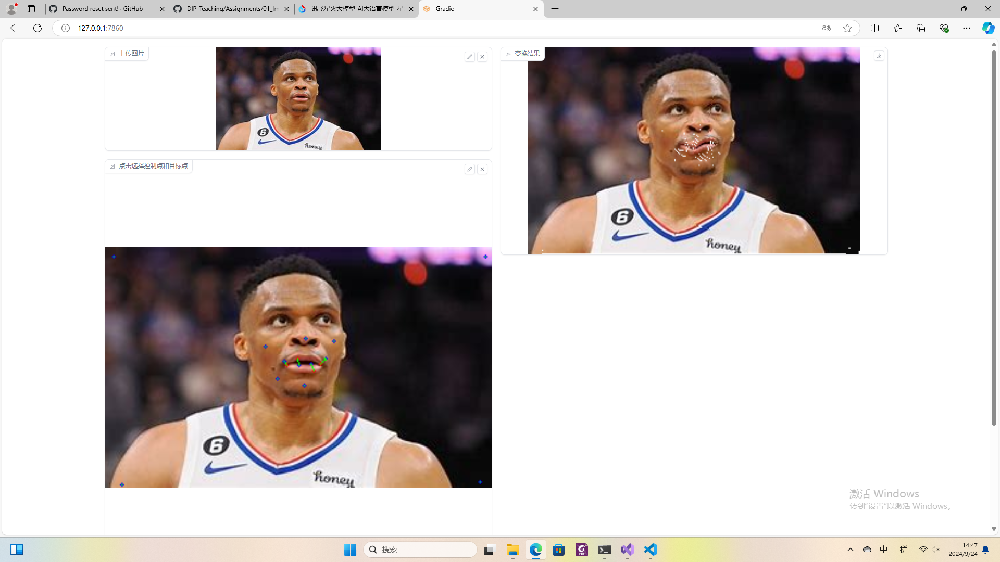
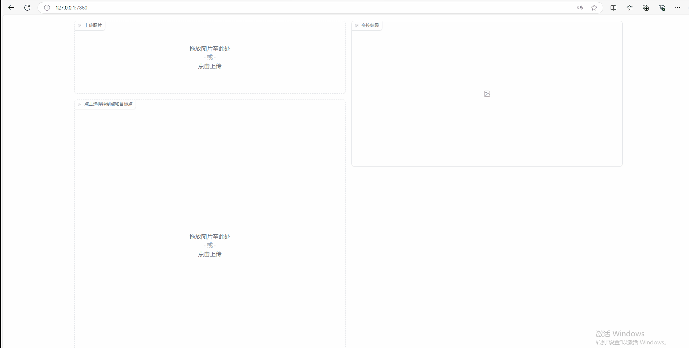

# Assignment 1 - Image Warping

## Homework Reult

Based on global transform, there may have been some issues with rounding during rotation, as some points were not assigned values, resulting in some white spots in the target image.

Based on Point Guided Deformation, I implemented the algorithm parts 2.1 Affine Deformations and 2.3 Rigid Deformations in the paper, with the latter performing better. Therefore, I am presenting its results. but in the end, there were some pixels in the target image that were not assigned values (points in the original image were not changed to reach this point), so there were some white spots on the character image.

Reflection: I have considered using inverse transformation to deduce the position of the pixels in the target image in the original image, but the weight values $w$ are related to the position of the source file $v$, so my idea may have some errors. I hope to receive your guidance.



## Requirements

To install requirements:

```setup
pip install numpy==1.26.4
pip install opencv-python
pip install gradio==3.36.1
```


## Running

To run basic transformation, run:

```basic
python run_global_transform.py
```

To run point guided transformation, run:

```point
python run_point_transform.py
```

## Results (need add more result images)
### Basic Transformation


### Point Guided Deformation:


## Acknowledgement

>📋 Thanks for the algorithms proposed by [Image Deformation Using Moving Least Squares](https://people.engr.tamu.edu/schaefer/research/mls.pdf).
