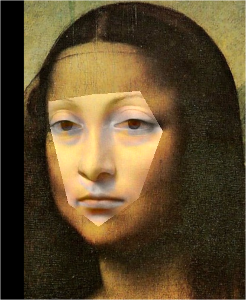

# Assignment 2 - DIP with PyTorch

### In this assignment, you will implement traditional DIP (Poisson Image Editing) and deep learning-based DIP (Pix2Pix) with PyTorch.

### Resources:
- [Assignment Slides](https://rec.ustc.edu.cn/share/705bfa50-6e53-11ef-b955-bb76c0fede49)  
- [Paper: Poisson Image Editing](https://www.cs.jhu.edu/~misha/Fall07/Papers/Perez03.pdf)
- [Paper: Image-to-Image Translation with Conditional Adversarial Nets](https://phillipi.github.io/pix2pix/)
- [Paper: Fully Convolutional Networks for Semantic Segmentation](https://arxiv.org/abs/1411.4038)
- [PyTorch Installation & Docs](https://pytorch.org/)

---

### 1. Implement Poisson Image Editing with PyTorch.
To run cloning, run:

```basic
python run_blending_gradio.py
```

To run seamless cloning, run:

```basic
python run_seamless_cloning.py
```

#### result showing:

clone:
<div style="display: flex; justify-content: space-around;">
  
  
</div>

seamless:
<div style="display: flex; justify-content: space-around;">
  
  
</div>


### 2. Pix2Pix implementation.
See [Pix2Pix subfolder](Pix2Pix/).
```basic
cd Pix2Pix
```

Download dataset, run:
Can modify download_facades_dataset.sh file in the FILE= facades, maps, citysacpes
```basic
bash download_facades_dataset.sh
```

To return semantic, run:

```basic
python train.py
```

To return rgb, run:

```basic
python train1.py
```

sematic:


rgb:


---
### Requirements:
- 请自行环境配置，推荐使用[conda环境](https://docs.anaconda.com/miniconda/)
- 按照模板要求写Markdown版作业报告
