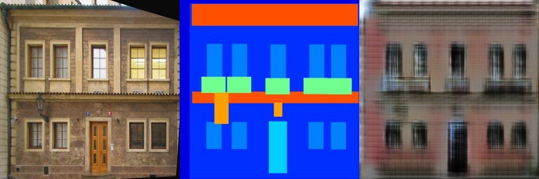
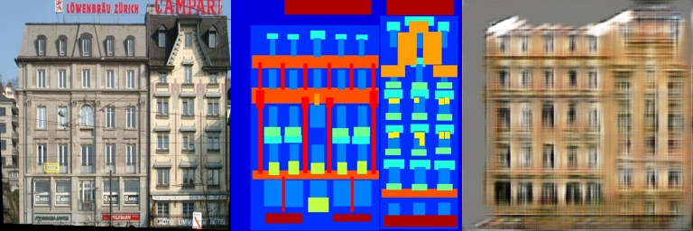
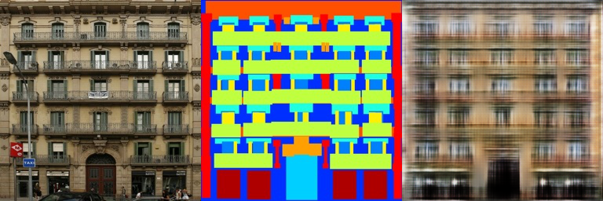
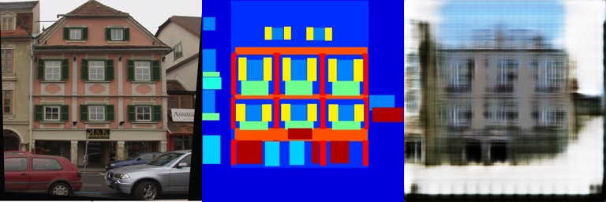
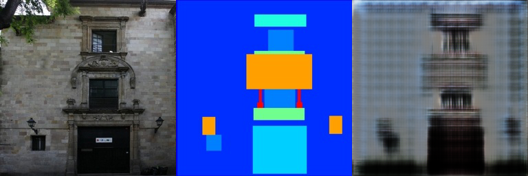
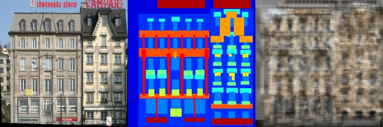
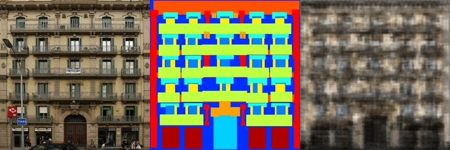
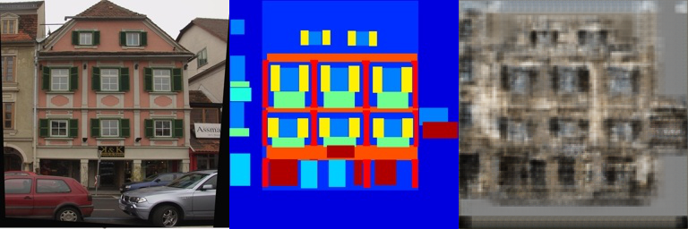
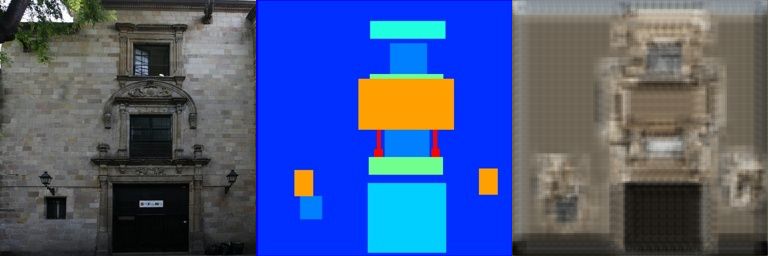

# Assignment 2 - DIP with PyTorch

### In this assignment, you will implement traditional DIP (Poisson Image Editing) and deep learning-based DIP (Pix2Pix) with PyTorch.

### Resources:
- [DragGAN](https://vcai.mpi-inf.mpg.de/projects/DragGAN/): [Implementaion 1](https://github.com/XingangPan/DragGAN) & [Implementaion 2](https://github.com/OpenGVLab/DragGAN)
- [Facial Landmarks Detection](https://github.com/1adrianb/face-alignment)

---

### 2. Pix2Pix implementation.
See [Pix2Pix subfolder](Pix2Pix/).
```basic
cd Pix2Pix
```

Download dataset, run:
Can modify download_facades_dataset.sh file in the FILE= facades, maps, citysacpes
```basic
bash download_facades_dataset.sh
```

To return rgb, run:

```basic
python train1.py
```

#### hw3






#### hw2






对比发现， hw3的模型在训练过程中，损失函数的值在逐渐下降，说明模型在训练过程中收敛良好，最后达到的效果也比hw2中CNN效果更好.

---
### Requirements:
- 请自行环境配置，推荐使用[conda环境](https://docs.anaconda.com/miniconda/)
- 按照模板要求写Markdown版作业报告
